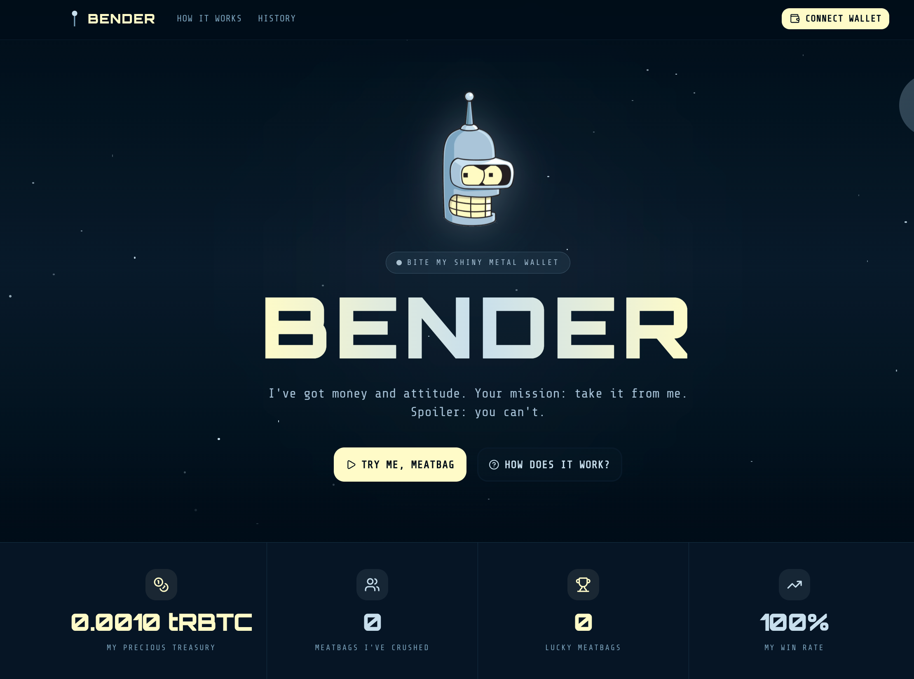

<p align="center">
  
</p>

# Bite My Shiny Metal Wallet

> *"You want my money? Convince me, meatbag."* — Bender

A smart contract game on **Rootstock (RSK) Testnet** with **Bender's personality** (Futurama). Bender holds funds and players place bets trying to win the pot. Each failed attempt doubles the cost, and blockchain randomness decides the outcome.

**Verified contract on RSK Testnet:** [`0x2015f0a58c66A7E41dC8BBCaa8F3c68A7aA54aB7`](https://rootstock-testnet.blockscout.com/address/0x2015f0a58c66A7E41dC8BBCaa8F3c68A7aA54aB7#code)

---

## How It Works

1. **Connect your wallet** to the RSK Testnet
2. **Send a message** to Bender and place a bet (1st transaction - `bet()`)
3. **Wait one block** for the blockchain to generate randomness
4. **Claim your result** (2nd transaction - `claim()`)
5. If you win, you take **90% of the treasury**. If you lose, Bender keeps your money and the cost doubles.

### Security Features

- **Blockhash future randomness**: The outcome is determined by a blockhash that doesn't exist at the time of betting, preventing prediction
- **Front-running protection**: Uses `msg.sender` in the hash calculation, so copying a transaction won't produce the same result
- **Commit-reveal pattern**: Message is sealed on-chain during `bet()`, result is revealed during `claim()`
- **Checks-effects-interactions**: State is updated before external calls to prevent reentrancy

### Game Economics

- Starting cost: **1 sat** (0.00000001 RBTC)
- Cost doubles after each loss, capped at **0.01 RBTC**
- Cost resets to 1 sat after a win
- Winner takes **90%** of the treasury, 10% stays for the next round
- Win probability depends on treasury size:
  - < 0.001 RBTC: 20% chance
  - < 0.01 RBTC: ~14% chance
  - < 0.1 RBTC: 10% chance
  - 0.1+ RBTC: 5% chance

---

## Tech Stack

| Layer | Technology |
|-------|-----------|
| **Smart Contract** | Solidity 0.8.25 on Rootstock (RSK) Testnet |
| **Frontend** | Next.js 16, React 19, TypeScript |
| **UI Components** | Radix UI, Tailwind CSS 4, shadcn/ui |
| **Wallet Connection** | Reown AppKit + Wagmi + Viem |
| **RPC Provider** | Alchemy (transactions, balance, contract calls) |
| **Event Indexing** | Blockscout API (event logs, history) |
| **Contract Verification** | Blockscout Explorer |

---

## Project Structure

```
bender_rsk/
├── smart-contract/
│   ├── contracts/
│   │   └── Bite-my-shiny-contract.sol
│   ├── scripts/
│   │   └── deploy.ts
│   ├── test/
│   │   └── Bite-my-shiny-contract.ts   # 29 tests
│   └── deployments/                     # Deploy info (gitignored)
└── frontend/
    ├── app/                  # Next.js pages
    ├── components/bender/    # UI components
    ├── config/               # Chain, contract & AppKit config
    ├── context/              # AppKit provider
    ├── hooks/                # Custom hooks (contract events)
    └── lib/                  # i18n, Blockscout API client
```

---

## Current Status

- [x] Project scaffolding (Next.js + Tailwind + shadcn/ui)
- [x] Smart contract with bet/claim pattern
- [x] Blockhash future randomness (front-running protection)
- [x] Progressive cost logic (doubling sats, capped at 0.01 RBTC)
- [x] 90% payout with 10% treasury retention
- [x] On-chain events (BetPlaced, Win, Loss)
- [x] NatSpec documentation with @custom:bender tags
- [x] 29 automated tests
- [x] Wallet connection with Reown AppKit
- [x] Chat interface connected to smart contract
- [x] Live stats from contract (treasury, wins, losses)
- [x] History from on-chain events via Blockscout API
- [x] Deploy to RSK Testnet
- [x] Contract verified on Blockscout and RSK Explorer

---

## Getting Started

### Smart Contract

```bash
cd smart-contract
npm install
```

Create a `.env` file:

```env
RSK_MAINNET_RPC_URL=https://public-node.rsk.co
RSK_TESTNET_RPC_URL=https://public-node.testnet.rsk.co
WALLET_PRIVATE_KEY=your_private_key_here
```

```bash
# Compile
npx hardhat compile

# Run tests
npx hardhat test

# Run local node
npx hardhat node

# Deploy to local node (in another terminal)
npx hardhat run scripts/deploy.ts --network localhost

# Deploy to RSK Testnet
npx hardhat run scripts/deploy.ts --network rskTestnet

# Verify on Blockscout
npx hardhat verify --network rskTestnet CONTRACT_ADDRESS
```

### Frontend

```bash
cd frontend
npm install
```

Create a `.env.local` file:

```env
NEXT_PUBLIC_REOWN_PROJECT_ID=your_reown_project_id
NEXT_PUBLIC_RSK_TESTNET_RPC=https://rootstock-testnet.g.alchemy.com/v2/your_alchemy_key
```

- Get a free Reown project ID at [dashboard.reown.com](https://dashboard.reown.com)
- Get a free Alchemy API key at [alchemy.com](https://www.alchemy.com) (used for RPC calls; RSK public node doesn't support `eth_getLogs`)
- Event history is fetched via Blockscout API (no key required)

```bash
# Run development server
npm run dev
```

---

<p align="center">
  <i>"I'm 100% blockchain. And 100% keeping your money."</i> — Bender
</p>
# front
